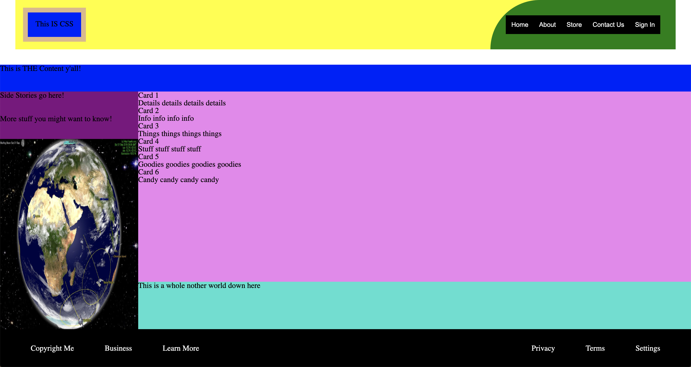
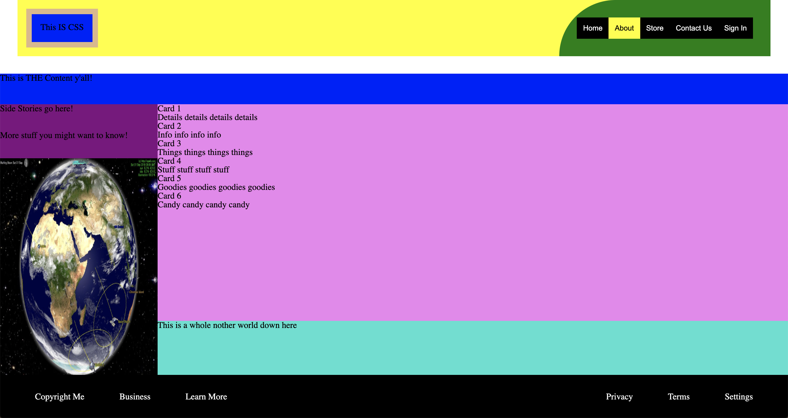
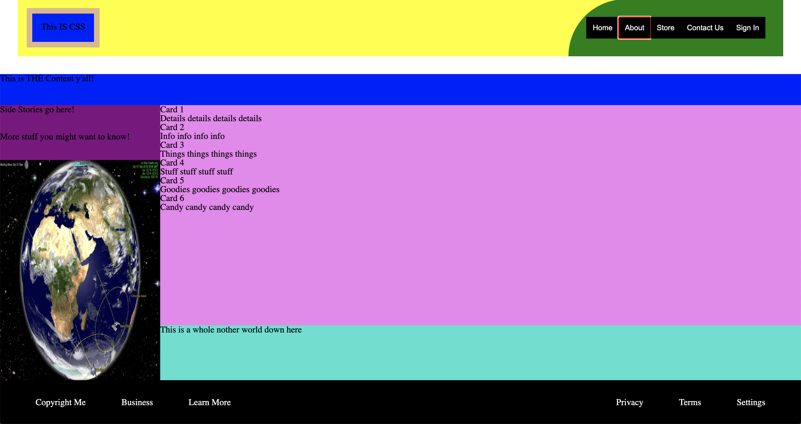

# Completed CSS (without Hover and Focus shown)

======

======
# Completed CSS (with only Hover shown)

======

======
# Completed CSS (with only Focus shown)

======

======
# Completed CSS (with Hover and Focus shown)
